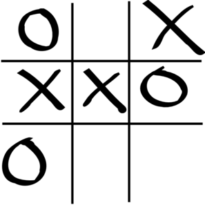

# Noughts and crosses

This is an attempt at recreating noughts and crosses, using Python and Numpy. It uses a 3x3 2D array to represent a noughts and crosses board.

## Languages and packages
To run these programs you will need Python3 and the following packages:
  * numpy